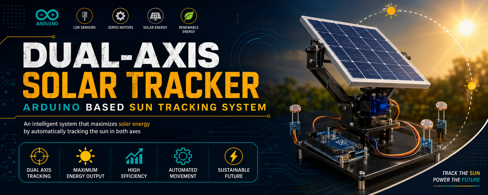
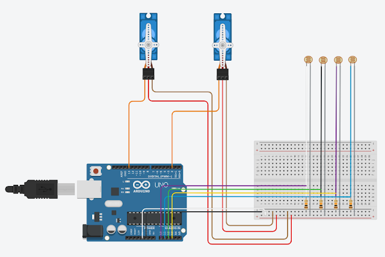

  

# 🌞 Arduino Dual-Axis Solar Tracking System

.png)

> An Arduino-based Dual-Axis Solar Tracking System that automatically tracks the sun using four LDR sensors and two servo motors to maximize solar energy generation.

---

# 📖 Overview

This project automatically aligns a solar panel with the direction of maximum sunlight using four LDR sensors and two SG90 servo motors. The Arduino UNO continuously reads light intensity from all four sensors and adjusts the panel on both horizontal and vertical axes for maximum solar efficiency.

---

# ✨ Features

- 🌞 Automatic Sun Tracking
- 🔄 Dual Axis Rotation
- 🤖 Arduino UNO Based
- 💡 Four LDR Sensors
- ⚡ Two SG90 Servo Motors
- 🔋 Higher Solar Efficiency
- 📉 Low Cost Design

---

# 🛠 Components Used

| Component | Quantity |
|-----------|----------|
| Arduino UNO | 1 |
| LDR Sensor | 4 |
| SG90 Servo | 2 |
| Solar Panel | 1 |
| 10K Resistor | 4 |
| Breadboard | 1 |
| Jumper Wires | Several |

---

# 🔌 Circuit Diagram

---

# ⚙ Working Principle

1. Four LDR sensors detect sunlight.
2. Arduino compares sensor values.
3. Horizontal servo moves left/right.
4. Vertical servo moves up/down.
5. Solar panel always faces maximum sunlight.

---

# 📸 Project Images

### Hardware Setup

### Working Model

---

# 📊 Advantages

✅ Increases power generation

✅ Tracks the sun automatically

✅ Low-cost implementation

✅ Easy to build

---

# 🚀 Future Improvements

- ESP8266 IoT Monitoring
- Mobile App Control
- Weather Detection
- RTC Based Tracking
- Solar Power Monitoring Dashboard

---

# 💻 Arduino Code

The complete Arduino code is available in:
